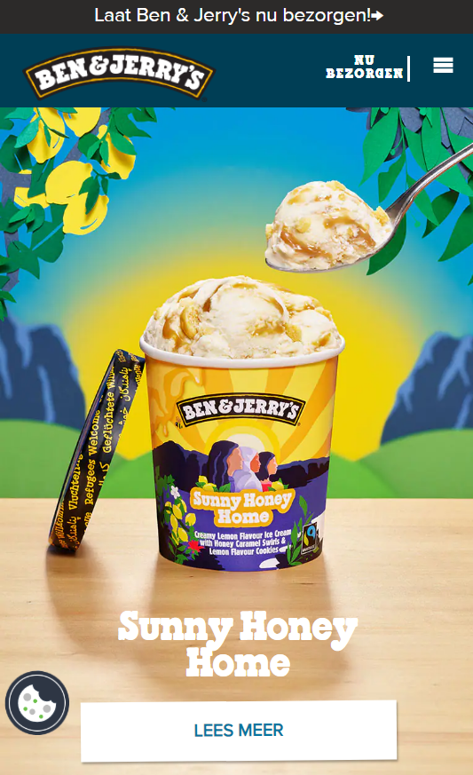
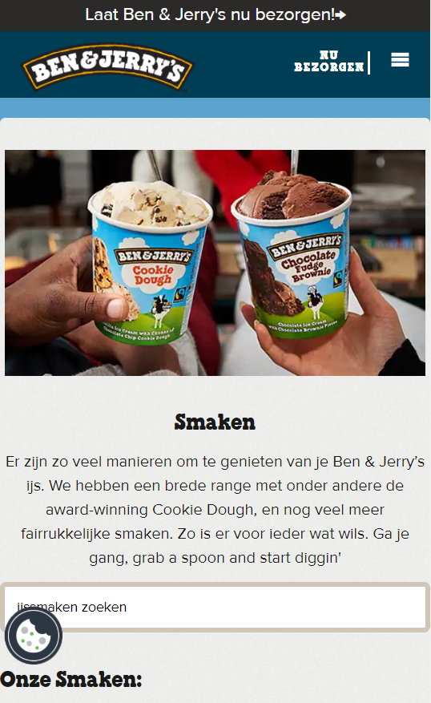
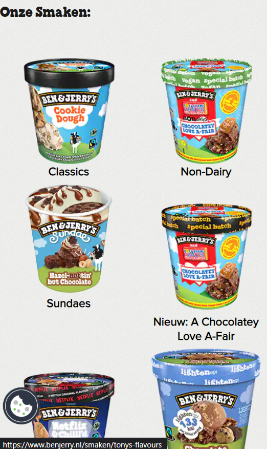
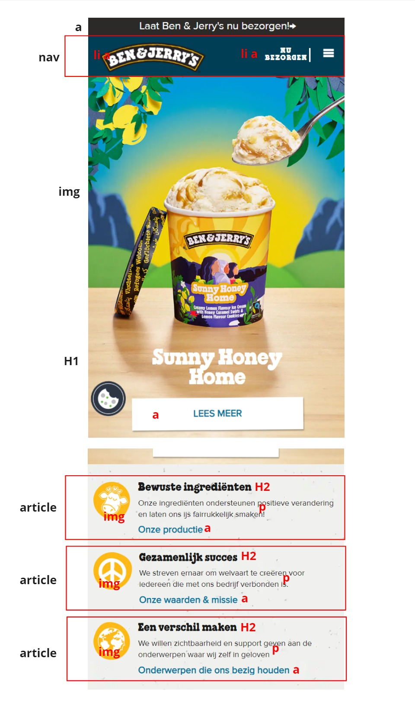

# Procesverslag
Markdown is een simpele manier om HTML te schrijven.  
Markdown cheat cheet: [Hulp bij het schrijven van Markdown](https://github.com/adam-p/markdown-here/wiki/Markdown-Cheatsheet).

Nb. De standaardstructuur en de spartaanse opmaak van de README.md zijn helemaal prima. Het gaat om de inhoud van je procesverslag. Besteedt de tijd voor pracht en praal aan je website.

Nb. Door *open* toe te voegen aan een *details* element kun je deze standaard open zetten. Fijn om dat steeds voor de relevante stuk(ken) te doen.

## Jij

  
uitwerken voor kick-off werkgroep

  ### Auteur:
  Sabri Özdil

  #### Je startniveau:
  blauw

  #### Je focus:
  responsive
 

## Je website

  
uitwerken voor kick-off werkgroep

  ### Je opdracht:
  Ben & Jerry's website 
  https://www.benjerry.nl/

  #### Screenshot(s) van de eerste pagina (small screen): 
  
  Home Pagina 
  
  

  #### Screenshot(s) van de tweede pagina (small screen):

  Smaken Pagina
  
  

  
 

## Toegankelijkheidstest 1/2 (week 1)

  
uitwerken na test in 2e werkgroep

  ### Bevindingen
  Lijst met je bevindingen die in de test naar voren kwamen:

## Breakdownschets (week 1)

  
uitwerken na afloop 3e werkgroep

  ### de hele pagina: 
  

## Voortgang 1 (week 2)

  
uitwerken voor 1e voortgang

  ### Stand van zaken
   Ik heb het gevoel dat ik tot zover goed bezig ben. Ik vind normaal gesproken code niet super leuk maar ik geniet van de FED lessen. Ik cind het leuk dat er een goede balans tussen zelfstandig werken en klassikaal bespreken is.
  
  Ik heb een begin gemaakt aan mijn HTML en CSS. Ik ben niet heel goed in Javascript maar ik begin het nu beter te begrijpen. De 5e werkgroep heeft mij geholpen om het systeem van JS beter te begrijpen. Ik heb twee lessen gemist in week 1 waarin Grid en toegankelijkheid werd behandeld. Die moet ik nog inhalen, ik weet namelijk bijna niets over Grid.

  ### Agenda voor meeting
  samen met je groepje opstellen

  | Michelle                   
  -Animatie                
  -Elementen aanspreken
  -Opbouw zonder div's
  
  | Tess
  -Flexbox in header
  -Typografie

  | Sabri
  -Wanneer welke methode gebruiken in CSS?

  ### Verslag van meeting
  hier na afloop snel de uitkomsten van de meeting vastleggen

  - De focus ligt op toegankelijkheid qua aanpassingen en verbeteringen op de website
  - Aria-labels zijn goed voor toegankelijkheid bij de buttons en forms

## Voortgang 2 (week 3)

  
uitwerken voor 2e voortgang

  ### Stand van zaken
  Bij het eerste voortgangsgesprek had ik mijn HTML pagina bijna afgemaakt, ik wilde deze week meer focussen op de CSS. Dat was mij gelukt, ik heb fonts toegevoegd, een hover animatie gemaakt etc. Ik heb nog steeds het gevoel dat ik achterloop maar het komt uiteindelijk wel goed.
 

  ### Agenda voor meeting

  
  | Tess
  - het lukt niet goed om de header te stylen met flexbox en het werkt niet goed mee
  - mijn afbeeldingen op de homepage moeten een lijst zijn waar je doorheen kan scrollen maar het lukt niet helemaal goed
  - bij mijn tweede pagina heb ik een background color toegevoegd maar die wordt nu ook toegepast op elementen waarbij ik dat niet wil.

  | Sabri
  - Wat is de beste manier om een hamburgermenu te maken?
  - Mag ik hier een article gebruiken? (zie code)

  ### Verslag van meeting
  hier na afloop snel de uitkomsten van de meeting vastleggen

  - In de header nav, zet logo als de eerste img in de HTML. Het is de belangrijkste item in de nav. Verander later de volgorde met CSS.
  - na elke section hoort er een h2 te zijn, dit kan je onzichtbaar maken met (zie bronnenlijst)
  - grid-template-column!! Verdiep je je in grid!
  - articles veranderen in ul, h2>h3, class=visually hidden
  - ga stap voor stap verder, section voor section, zo wordt elke stap makkelijker
  - code voor zoekbalk laten verschijnen stuurt Sanne naar Helena

## Toegankelijkheidstest 2/2 (week 4)

  
uitwerken na test in 9e werkgroep

  ### Bevindingen
  Lijst met je bevindingen die in de test naar voren kwamen (geef ook aan wat er verbeterd is):

  -Ik kan met Tab de hele homepagina door, maar ik moet nog een paar sections uitwerken voordat de hele pagina af is.

  -Met de screenreader zijn alle headings en links te lezen, ze hebben als het goed is allemaal beschrijvingen en/of aria-labels.

  

## Voortgang 3 (week 4)

  
uitwerken voor 3e voortgang

  ### Stand van zaken

  Ik heb mijn eerste pagina eindelijk af, ik moet alleen nog de tweede pagina maken, maar die wordt wel een stukje makkelijker omdat ik meeste elementen kan kopieren en plakken naar de tweede pagina. Ik ben nog bezig met responsive maken, ik weet niet of dit goed gaat lukken met de tweede pagina.

  ### Agenda voor meeting
  samen met je groepje opstellen

 | Tess
  - Hoe maak ik een element onzichtbaar?

  | Sabri
  - Mijn hover animatie met scale werkt niet op de navbar

  ### Verslag van meeting
  

  - Ik moest display: inline-block gebruiken voor de hover animatie

## Eindgesprek (week 5)

  
uitwerken voor eindgesprek

  ### Je uitkomst - karakteristiek screenshots:
  

  ### Dit ging goed/Heb ik geleerd: 
  Korte omschrijving met plaatjes

  

  ### Dit was lastig/Is niet gelukt:
  Korte omschrijving met plaatjes

  

## Bronnenlijst

  
continu bijhouden terwijl je werkt

  Nb. Wees specifiek ('css-tricks' als bron is bijv. niet specifiek genoeg). 
  Nb. ChatGpT en andere AI horen er ook bij.
  Nb. Vermeld de bronnen ook in je code.

  1. Hamburger menu BRON: https://codepen.io/shooft/pen/MWZYoqa
  2. zoekbalk laten verschijnen BRON: https://codepen.io/shooft/pen/JjxmvrL
  3. bron: https://www.a11yproject.com/posts/how-to-hide-content/ 
  4. https://css-tricks.com/almanac/properties/o/object-position/
  5. ChatGPT

